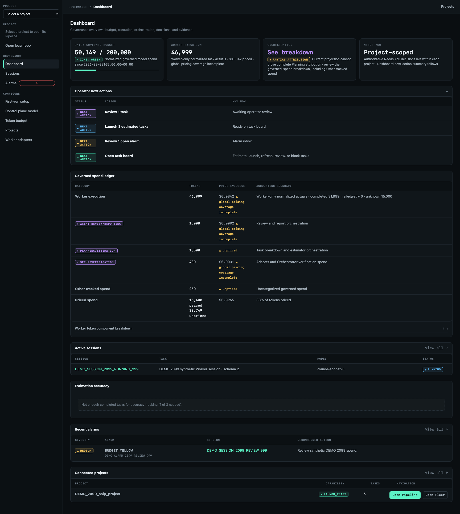

# Foreman AI HQ

Foreman AI HQ is a local, portal-first governance harness for AI coding agents.

It does **not** replace OpenCode, Claude Code, Codex, or another coding CLI. It wraps those tools with a board, budgets, launch checks, token evidence, session reports, and human review.

Use it when you want a coding agent workflow that is easier to inspect:

- estimate work before launch
- break larger plans into smaller governed slices
- investigate bounded repository uncertainty in Planning Chat before creating work
- plan work in a project Pipeline and run coding agents from its Execution Floor
- keep long-running agent work from turning into one polluted mega-thread: each slice gets its own scoped Worker run, while the Harness preserves the plan, budget, evidence, and review state
- record Worker Run evidence, stdout/stderr, token usage, and review state
- keep budget overrides and final acceptance in human hands

## Current supported path

Today the supported operator path is local all-in-one mode:

```text
installed foremanctl CLI
  -> local Portal / Control Plane
  -> local repo connection
  -> verified local Worker CLI, such as OpenCode
  -> session report and token evidence
```

The Worker CLI keeps its own auth/config. Foreman AI HQ configures the orchestrator model separately for estimates, planning, recommendations, summaries, and reports.

Foreman AI HQ only governs work launched through its own board and a verified Worker Adapter. It does not govern arbitrary external agent spend.

## Install

Recommended source install before PyPI release:

```bash
pipx install "git+https://github.com/alexdancer/foreman-ai-hq.git"
cd /path/to/your/repo
foremanctl init
foremanctl serve
```

One-line bootstrap alternative:

```bash
curl -fsSL https://raw.githubusercontent.com/alexdancer/foreman-ai-hq/main/install.sh | sh
foremanctl init
foremanctl serve
```

After the package is published to PyPI, the intended command is:

```bash
pipx install foreman-ai-hq
foremanctl init
foremanctl serve
```

For contributors working from a checkout:

```bash
uv run foremanctl init
uv run foremanctl serve
```

More install detail: [docs/INSTALL.md](docs/INSTALL.md).

To update an existing install before PyPI release, rerun the curl installer or
`pipx install --force "git+https://github.com/alexdancer/foreman-ai-hq.git"`.
This updates the global `foremanctl` CLI and preserves repo-local `.foreman/` state. See
[docs/INSTALL.md](docs/INSTALL.md#updating-foreman-ai-hq).

## First run

1. Start the Portal:
```bash
 foremanctl serve
```
2. Open `http://localhost:8000/`.
3. Open `/settings/control-plane`.
4. Run `pi /login` to authenticate with your provider, then choose an Orchestrator Model from pi's inventory and verify it.
5. Connect a local repository from `/projects`.
6. Open `/settings/workers`, choose a Worker Adapter, discover/allow Worker models, then verify token tracking.
7. Open the project's Pipeline at `/projects/{project_id}`, shape a tiny task in Planning Chat, select **Create governed work**, and launch the resulting Estimated Task.
8. Follow the run on `/projects/{project_id}/floor`; open its Evidence Drawer before marking the task done.

Default loopback `foremanctl serve` opens the local Portal without a login token. If you bind the Portal to `0.0.0.0`, run it behind a proxy, or use Docker/shared access, keep the portal token from ignored `.foreman/secrets.env` and sign in through `/login`.

For redacted support status:

```bash
foremanctl check
```

## Portal UI

Representative local Portal screens using synthetic/public-safe data:




## How the workflow works

1. **Shape work** in Planning Chat, then explicitly submit it as governed intake. The recorded `single_task` or `needs_breakdown` decision and reason determine the next step.
2. **Estimate** with the Orchestrator Model.
3. **Launch** through a verified Worker Adapter.
4. **Run async** on the Execution Floor while the Portal stays responsive.
5. **Review evidence** in the card's side drawer: command plan, Worker events, token usage, checkpoints, and Agent Review; the Session Report remains the full permalink.
6. **Accept or block** as the human operator.

Task lifecycle states are:

```text
Estimated -> Running -> Review -> Done
```

Blocked is a condition badge, not a fifth column: the Task stays in its lifecycle state while Needs You explains the reason and required operator action. Needs You also aggregates pending Task Breakdowns, manual estimates, review dispositions, launch guardrails, budget overrides, and advisory low-confidence estimates at the top of the Pipeline.

Task kind is explicit: `implementation` or `acceptance_verification`. An implementation Task delivers a change, while Acceptance Verification proves an integrated result against its source contract.

### When an estimate is uncertain

An automatic estimate below `0.60` confidence creates an advisory Needs You item. It does not move the Task, block launch by itself, or silently spend more tokens. The operator can:

- acknowledge the current estimate;
- enter a manual estimate; or
- open Planning Chat to investigate the repository facts needed for an honest estimate.

Planning Chat investigation is orchestration work, not a separate Task. After refining the contract, use **Create governed work** to record a fresh structured intake decision and reason.

### With a Markdown file

For a larger `.md` plan, paste the Markdown into Planning Chat or upload the file, then select **Create governed work** instead of turning every bullet into a task yourself:

```text
.md plan
  -> Task Breakdown Agent applies the Task Slicing Policy
  -> you review the proposed AFK/HITL cards, proof, dependencies, and rejected non-tasks
  -> accepted cards are estimated and added to the board
  -> each card launches as its own scoped Worker run
  -> final Acceptance Verification checks the original Markdown contract
```

The Harness keeps the full source Markdown in the review record. Each Worker gets only the compact objective, boundaries, proof command, dependencies, likely entry points, and execution mode for its slice.

## Basic architecture

Foreman AI HQ has four main pieces:


| Piece                        | Role                                                                                                                                                                                     |
| ---------------------------- | ---------------------------------------------------------------------------------------------------------------------------------------------------------------------------------------- |
| **Portal / Control Plane**   | Browser UI and API for setup, estimates, project boards, launch, reports, budgets, and review.                                                                                           |
| **Local Runner**             | Runs near your local repository so Worker CLIs can see local files, git state, and their own credentials. In local mode it runs inside the same app process.                             |
| **Worker Adapter**           | Integration for a coding CLI such as OpenCode, Claude Code, or Codex. Adapter verification proves the CLI can run and produce trustworthy usage evidence for the selected model. |
| **Token ledger and reports** | SQLite-backed records for estimates, Worker Runs, token evidence, alarms, checkpoints, and session artifacts.                                                                            |


There are two model layers:


| Layer                   | Used for                                                      | Auth/config                                                     |
| ----------------------- | ------------------------------------------------------------- | --------------------------------------------------------------- |
| **Orchestrator model** | estimates, planning, task breakdown, recommendations, reports | selected from pi inventory; provider auth via `pi /login`       |
| **Worker model**        | the actual coding task                                        | configured by the native Worker CLI                             |


Optional direct-provider credentials configure only Harness Proxy upstream traffic for `proxy_governed` Workers. They do not configure pi or a native Worker CLI.

## Local files and configuration

`foremanctl init` creates local-only state under `.foreman/`:

Run it from the repository you want Foreman AI HQ to govern. If you run it from a Git subdirectory, it initializes the Git repository root; outside Git, it initializes the current directory.

| File                   | Purpose                                                        |
| ---------------------- | -------------------------------------------------------------- |
| `.foreman/config.toml`     | non-secret local config                                        |
| `.foreman/secrets.env`     | ignored portal token and optional Harness Proxy upstream key storage |
| `.foreman/guardrails.yaml` | ignored default guardrail config                               |
| `.foreman/harness.db`      | default SQLite database, created or migrated by `foremanctl init`     |


For normal local use, prefer the Portal settings screens. Environment variables are mainly for CI, headless runs, or compatibility. Config files may use either `orchestrator_model` or the legacy `control_plane_model`; both resolve to the same setting.

Common environment variables:


| Variable                        | Purpose                                                                       |
| ------------------------------- | ----------------------------------------------------------------------------- |
| `TOKEN_TRACKER_PORTAL_TOKEN`    | Portal login token for shared/non-loopback access                             |
| `FOREMAN_AI_HQ_ORCHESTRATOR_MODEL`  | Orchestrator model chosen from pi's inventory                                 |
| `FOREMAN_AI_HQ_CONTROL_PROVIDER`   | Optional Harness Proxy upstream provider for `proxy_governed` Workers         |
| `FOREMAN_AI_HQ_CONTROL_BASE_URL`   | Optional Harness Proxy upstream base URL                                      |
| `FOREMAN_AI_HQ_CONTROL_API_KEY`    | Optional Harness Proxy upstream API key; never pi or native Worker CLI auth    |


Optional Harness Proxy upstream keys belong in ignored local secret storage or the shell environment; the Orchestrator settings page does not collect them. The Orchestrator Model is selected from pi's discovered inventory, and its provider authentication belongs to pi.

## Current limits

- The main supported path is local all-in-one mode.
- Worker launch readiness depends on local repo access, git state, installed Worker CLIs, and native CLI auth/config.
- Hosted workspaces, a fuller CLI, MCP access, and Homebrew install are future work.

## More docs

- [Getting started](docs/GETTING_STARTED.md)
- [Harness architecture and workflow](docs/HARNESS.md)
- [Install options](docs/INSTALL.md)
- [Worker Adapter setup](docs/WORKER_ADAPTER_SETUP.md)
- [Setup support checklist](docs/SETUP_SUPPORT_CHECKLIST.md)
- [Contributing](CONTRIBUTING.md)
- [Changelog](CHANGELOG.md)
- [Project TODO](docs/TODO.md)

## Tests

```bash
uv run --extra test pytest -q
```

This run includes the browser tests under `tests/e2e`, which build the React
shell and drive Chromium. They need Node plus a one-time browser install:

```bash
npm --prefix frontend install
uv run --extra test playwright install chromium
```

To skip them, run the focused checks below instead.

Focused contributor checks:

```bash
uv run foremanctl --help
uv run --extra test pytest tests/portal tests/api tests/workers -q
uv run --extra test pytest tests/evals -v
```

Tests use fake LLM clients. They do not make provider calls.
